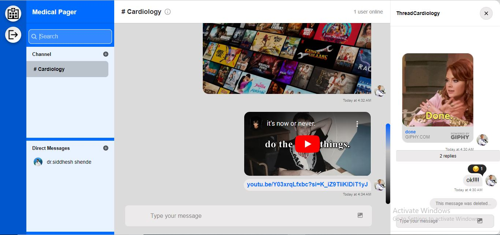
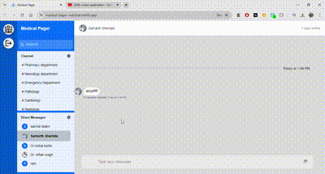
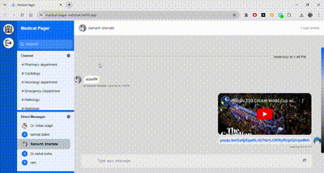

<a name="readme-top"></a>

<div align="center">

</div>

<h1 align="center"> Medical Pager <br/> <span style="font-size:10px;">A Secure Chat App for Busy Hospitals</span></h1>


<div align="center">


</div>

## Tech Stack and tools:
  <span> 
  
  
  
   
   
   
  
  
  
   
  
  </span>
- **Frontend:** HTML,Css,JavaScript,React.
- **Backend:** Node.js,Express.
- **Real-time Messaging:** Stream API.
- **SMS Notifications:** Twilio.
- **Version Control:** Git and GitHub.
- **Hosting:** Netlify(frontend) and Render(backend).
- **Code Editor:** VS Code.
- **Analytics:** Google Analytics.
- **CSS Methodology:** BEM (Block Element Modifier).

 <br />

   <h3 align="center">✨ Welcome to Medical-Pager ✨ </h3> <hr>

# Table of Contents
<details>
  <summary>Click to expand</summary>
  
  - [Overview](#overview)
  - [Problem and Solution](#problem-and-solution)
  - [Key Features](#key-features)
  - [Advanced Concepts Implemented](#advanced-concepts-implemented)
  - [Dependencies Used](#dependencies-used)
  - [API & Services](#api--services)
  - [Usage Notes](#usage-notes)
  - [Security and User Management](#Security-and-User-Management)
  - [Installation](#installation)
  - [Contributing](#contributing)
  - [License](#license)
  - [Acknowledgements](#acknowledgements)
  
  </details> 

## Overview🔨
Think of a chat applications created mainly for hospitals and healthcare professionals that is just as reliable as a pager but has the features of a modern chat platform. That's MedicalPager!!. It allows doctors and medical personnel to remain connected and up to date with their hospital divisions, which results in seamless communication and better patient care.

## Problem and Solution

## The Problem🆘

In the fast-moving, high-stakes world of hospitals, efficient communication is essential. However, traditional means of communication have certain limitations:

1. **Traditional Pagers:** While reliable and capable of penetrating thick hospital walls, they have limited functionality and only allow for one-way communication.
2. **Cell Phones:** Cell phones are frequently unreliable in hospital settings due to poor reception and network congestion during emergency situations.
3. **Multiple Systems:** Using several communication technologies results in disorganised data and possibly miscommunication.

Healthcare personnel want a platform that combines the dependability of pagers with the capability of current communication apps, all while responding to the specific needs of the medical field.

## Our Solution

The Medical Pager Chat App responds to these issues by:

1. **Reliable Infrastructure:** Using robust messaging systems to ensure communication even in locations with low cell coverage.
2. **Advanced Functionality:** Provides two-way communication with features such as direct and group conversations, multimedia sharing, and threaded replies.
3. **Emergency-Ready:** Prioritise sending messages in critically important situations to verified personnels, same as traditional pager systems does.
4. **Unified Platform:** Offers a single, standardised communication tool that can be utilised among various hospital departments.
5. **Always Connected:** Using SMS notifications to notify verified users of vital messages when offline.
6. **User Friendly Design:** Featuring a straightforward UI that is simple to understand and apply, even in high-pressure situations.

Our Medical Pager Chat App combines the features of traditional pagers and current chat applications to deliver a complete, dependable, and effective communication solution for healthcare professionals, eventually improving patient care and the operation of hospitals.

<div align="center">

</div>

 


## Key Features:

- Authentication with secure user management.
- Direct and group chat functionality.
- Multimedia support (GIFs, photos, YouTube embeds)
- YouTube video playback within the chat.
- Message editing and deletion.
- Threaded replies for structured conversations.
- Giphy integration via the `/giphy' command.
- search functionality for channels and users.
- Fully responsive design for all devices.
- Twilio for real-time SMS notifications.
- Upload local files directly into the chat.
- Mentions (hey @you) to mention specific users.
- Webhooks for event-driven notifications and integrations.

## Advanced Concepts Implemented🧠

- Efficient folder and file structure
- React Context API for state management
- Integration with Stream API for scalable chat infrastructure
- Custom hooks for reusable logic and many more...

 <p align="right">(<a href="#readme-top">back to top</a>)</p>

## Dependencies used🖥️

- [x] React(you know,why it is used😄)
- [x] Stream Chat React (for chat functionality)
- [x] Universal Cookie (for cookie management)
- [x] Axios (for API calls)
- [x] Stream Chat (for chat infrastructure)
- [x] Express (web application framework)
- [x] Twilio (for SMS notifications)
- [x] bcrypt (for password hashing)
- [x] cors (for enabling CORS)
- [x] dotenv (for environment variable management)
- [x] crypto (for cryptographic functionality)
- [x] nodemon (for auto-restarting the server during development)

### API & Services
- [x] Stream API (for real-time messaging)
- [x] Twilio API (for SMS services)
- [x] Google Analytics (for user interaction tracking)

## Usage Notes

1. If you encounter any errors during sign-in or sign-up, please refresh the page and try again.
2. When setting up your profile, you need to provide a URL for your avatar (profile picture).
3. To use GIFs in your messages, type `/giphy [keyword]` (e.g., `/giphy hello` to find a "hello" GIF).
4. To mention a specific user in a chat, type `@username`.
5. The project code includes various comments which clarify functionality and increase readability. These comments can be useful for understanding the code's structure and logic.

   <p align="right">(<a href="#readme-top">back to top</a>)</p>

   ## Security and User Management

We've implemented strict rules for managing members/users across all types of chats in Medical Pager to ensure security and proper access control:

* **Automatic Memberships:**
   * Users cannot leave or be removed from chats they were automatically added to. For example:
     - Doctors cannot leave or be removed from their hospital's general chat
     - Department heads cannot leave or be removed from their department's chat

* **Private Conversations:**
   * Members cannot leave or be removed from their private conversations (DMs)

* **Administrative Control:**
   * Hospital administrators have the highest level of control and can manage most user access, with some exceptions

* **Department-Specific:**
   * Department members cannot leave or be removed from their department's dedicated chat

* **Patient-Related Chats:**
   * The primary physician cannot leave or be removed from their patient's case discussion
   * Assigned nurses cannot leave or be removed from their patients' care coordination chats

* **Administrative Powers:**
   * Hospital administrators can remove any regular user from any chat, except where noted above

These rules are designed to maintain the integrity of communication channels, ensure that critical information reaches the right people and prevent accidental or unauthorized removal of essential personnel from important conversations.

<p align="right">(<a href="#readme-top">back to top</a>)</p>
   
## Installation

### Frontend setup:

1. **Clone the repository**:
    ```bash
    git clone https://github.com/yourusername/medical-pager.git
    cd medical-pager/client
    ```

2. **Install dependencies**:
    ```bash
    npm install
    ```
    
3. **Start the development server**:
    ```bash
    npm start
    ```
can also refer client's README.md file for more details.
 
   ### Backend setup: 

1. **Navigate to the server directory**:
    ```bash
    cd ../server
    ```

2. **Install dependencies**:
    ```bash
    npm install
    ```

3. **Set up environment variables**:
   Open the `client/src/App.js` and `client/src/Components/Auth.js` files and replace the placeholders with your actual API keys and tokens:
    Create a `.env` file in the root directory of the `server` folder and add the following variables:
    ```plaintext
     STREAM_APP_ID=your_stream_app_id
    STREAM_API_SECRET=your_stream_api_secret
    STREAM_API_KEY=your_stream_api_key
    TWILIO_ACCOUNT_SID=your_twilio_account_sid
    TWILIO_AUTH_TOKEN=your_twilio_auth_token
    TWILIO_MESSAGING_SERVICE_SID=your_twilio_messaging_service_sid
    ```
   Replace `your_*` with your actual API keys and tokens.

4. **Start the backend server**:
    ```bash
    npm start
    npm run dev
    ```
   
<p align="right">(<a href="#readme-top">back to top</a>)</p>

## Contributing🤝

We welcome contributions to improve MedicalPager! Here's how you can contribute:

1. Fork the repository.
2. Create a new branch for your feature or bug fix:
    ```bash
    git checkout -b feature/AmazingFeature
    ```
3. Commit your changes and push to the branch:
    ```bash
    git commit -m 'Add some AmazingFeature'
    git push origin feature/AmazingFeature
    ```
4. Open a Pull Request with a detailed description of your changes.
5. Voila ❗ You have made a PR to this awesome projects💥. Wait for your submission to be accepted and your PR to be merged.

<p align="right">(<a href="#readme-top">back to top</a>)</p>

## License

This project is licensed under the MIT License - see the [LICENSE](LICENSE) file for details.

## Acknowledgements

Quite a lot of the code in this repo came from [GetStream](https://getstream.io/).

<p align="right">(<a href="#readme-top">back to top</a>)</p>
<hr>

<div align="center">
Made with ❤️ for healthcare professionals
</div>
